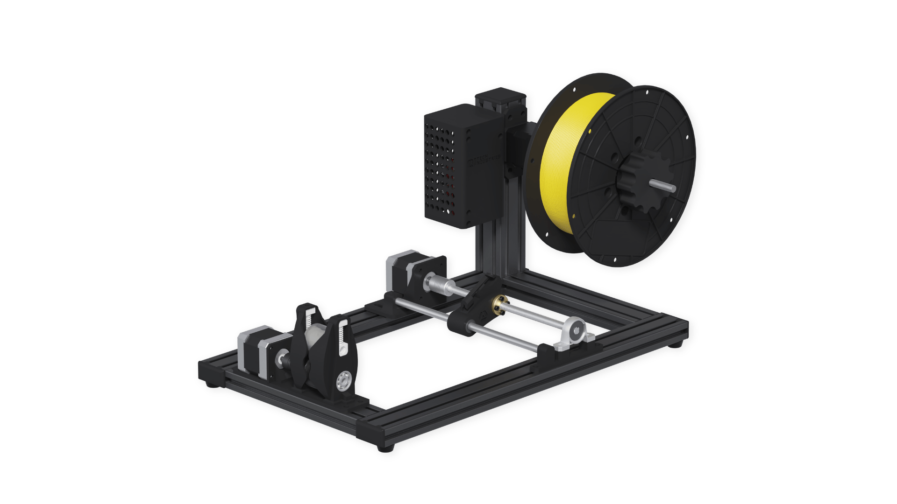

<div id="top"></div>

<!-- PROJECT SHIELDS -->
[![Contributors][contributors-shield]][contributors-url]
[![Issues][issues-shield]][issues-url]
[![Last Commit][commit-shield]][commit-url]
[![GPL-3.0 License][license-shield]][license-url]

<!-- PROJECT LOGO -->
<br />
<div align="center">
  <a href="https://github.com/QiTech-Industries/Winder">
    
  </a>

  <h2 align="center">JARVIS Winder</h2>

  <p align="center">
Control Code of the Jarvis Winder running on an ESP32
    <br />
    <a href="https://github.com/QiTech-Industries/Winder/tree/main/documentation"><strong>Explore the docs »</strong></a>
    <br />
    <br />
    <a href="https://github.com/QiTech-Industries/Winder/issues">Report Bug</a>
    ·
    <a href="https://github.com/QiTech-Industries/Winder/issues">Request Feature</a>
    ·
    <a href="https://github.com/QiTech-Industries">Related Projects</a>
  </p>
</div>


<!-- TABLE OF CONTENTS -->
<details>
  <summary>Table of Contents</summary>
  <ol>
    <li>
      <a href="#about-the-project">About The Project</a>
      <ul>
        <li><a href="#built-with">Built With</a></li>
      </ul>
    </li>
    <li>
      <a href="#getting-started">Getting Started</a>
      <ul>
        <li><a href="#installation">Installation</a></li>
      </ul>
    </li>
    <li><a href="#common-issues">Common Issues</a></li>
    <li><a href="#roadmap">Roadmap</a></li>
    <li><a href="#contributing">Contributing</a></li>
    <li><a href="#license">License</a></li>
    <li><a href="#contact">Contact</a></li>
  </ol>
</details>


<!-- ABOUT THE PROJECT -->
## About The Project

<div align="center">
  <a href="https://github.com/QiTech-Industries/Winder">
    
  </a>
  </div>

This project covers the code for the Jarvis Winder, which is a machine for winding filaments used for 3D-printing. The winder is used to wind freshly extruded filament on spools and rewind filament from one spool to another. The machine can be controlled via [Webinterface](https://github.com/QiTech-Industries/WinderWebInterface), which can be accessed with mobile devices, too. The winder can either log into an existing wifi or create its own on the fly.

<p align="right">(<a href="#top">back to top</a>)</p>


### Built With

Currently the following libraries are in use:

| Library           | Info                                                 | License |
| ----------------- | ---------------------------------------------------- | ------- |
| ArduinoJson       | https://arduinojson.org/                             | MIT     |
| Timer             | https://github.com/brunocalou/Timer                  | MIT     |
| ESPAsyncWebServer | https://github.com/me-no-dev/ESPAsyncWebServer       | GNU-2.1 |
| LittleFS          | https://github.com/lorol/LittleFS.git                | GPL-2.0 |
| HardwareControl   | https://github.com/QiTech-Industries/HardwareControl | GPL-3.0 |

And the following main hardware components:
- Nema 17 (17HS19-2004S1)
- Nema 17 Planetary 1:5.18 (17HS19-1684S-PG5)
- TMC2130
- ESPduino (ESP32WROOM32)
- CNC Shield

<p align="right">(<a href="#top">back to top</a>)</p>


<!-- GETTING STARTED -->
## Getting Started

### Usage
To get a local copy flashed to the machine run these simple steps.

1. Download the latest firmware-full.bin file from the releases section.
2. Use the ESP Web flashing tool: https://espressif.github.io/esptool-js/ (recent Chrome or Edge Version)
  - install correct drivers so the ESP is recognized by the PC 
  - select baude 115200 and click connect
  - grant access to the serial port your esp is connected to
  - set "flash address" to 0x0 and upload firmware-full.bin
  - click the program button
  - once finished press the reset button on the esp once and you should be all set ready to go 🏎️

### Installation

These steps are only required if you want to develop the library. In case you just want to use it in one of your projects refer to [Usage](#usage)

1. Install the PlatformIO extension in VsCode `platformio.platformio-ide`
2. Install the C++ extension in VsCode `ms-vscode.cpptools`
3. Install ESP32 drivers (depending on the USB-UART Chip)
     - CP210 https://www.silabs.com/developers/usb-to-uart-bridge-vcp-drivers
     - CH341 http://www.wch.cn/downloads/CH341SER_EXE.html
4. Clone the repo
   ```sh
   git clone --recurse-submodules https://github.com/QiTech-Industries/Winder.git
   ```
5. Install the project dependencies
   ```sh
   cd Winder && pio pkg install
   ```
   When using Windows you need to add `pio` to your path first or use the full path `C:\Users\<username>\.platformio\penv\Scripts\platformio.exe`
6. Upload the code and open Serial Monitor
   ```sh
   pio run --target upload --target monitor --environment src
   ```
   Alternatively you can use `PlatformIO->src->Upload and Monitor` in the left Sidebar

<p align="right">(<a href="#top">back to top</a>)</p>

## Common Issues
- Imported files are not recognized (Intellisense Index build fails)
  - delete .pio folder
  - delete launch.json and s_cpp_properties.json in .vscode folder
  - `STRG + SHIFT + P` Rebuild Intellisense Index

<p align="right">(<a href="#top">back to top</a>)</p>

<!-- ROADMAP -->
## Roadmap
This project should slowly adapt to the new Winder versions. This means apart from the WS interface there will also be a Serial interface implemented and an option for DC Motor control as well as the possibility of multiple hardware versions.

For the coming releases a new code structure is planned to make the code more modular and object oriented. Some refactored classes and a glimpse of the new code organization can be found in the [big-refactoring](https://github.com/QiTech-Industries/Winder/tree/big-refactoring) branch that will slowly get merged into main.

Apart from that all upcoming features are created and discussed as issues first.
See [open issues](https://github.com/QiTech-Industries/Winder/issues) for a full list. This is the most up to date roadmap you can get. Feel free to report new issues or fix existing ones.

<p align="right">(<a href="#top">back to top</a>)</p>


<!-- CONTRIBUTING -->
## Contributing

Contributions are what make the open source community such an amazing place to learn, inspire, and create. Any contributions you make are **greatly appreciated**.

If you have a suggestion that would make this better, please open a issue with the tag "enhancement" to discuss whether your idea is in line with our Roadmap and we can find the best way of implementing it.

Than:

1. Fork the Project
2. Create your Feature Branch (`git checkout -b feature/AmazingFeature`)
3. Commit your Changes (`git commit -m 'Add some AmazingFeature'`)
4. Push to the Branch (`git push origin feature/AmazingFeature`)
5. Check whether your code complies with the [coding guidelines](documentation/coding_conventions.md)
6. Open a Pull Request

<p align="right">(<a href="#top">back to top</a>)</p>


<!-- LICENSE -->
## License

Distributed under the GPL-3.0 License. See `LICENSE` for more information.

<p align="right">(<a href="#top">back to top</a>)</p>


<!-- CONTACT -->
## Contact

QiTech Industries - [https://qitech.de/industries](https://www.qitech.de/industries) - contact@qitech.de

Project Link: [https://github.com/QiTech-Industries/Winder](https://github.com/QiTech-Industries/Winder)

<p align="right">(<a href="#top">back to top</a>)</p>

<!-- MARKDOWN LINKS & IMAGES -->
<!-- https://www.markdownguide.org/basic-syntax/#reference-style-links -->
[contributors-shield]: https://img.shields.io/github/contributors/QiTech-Industries/Winder?style=for-the-badge
[contributors-url]: https://github.com/QiTech-Industries/Winder/graphs/contributors

[commit-shield]: https://img.shields.io/github/last-commit/QiTech-Industries/Winder?style=for-the-badge
[commit-url]: https://github.com/QiTech-Industries/Winder/commits

[issues-shield]: https://img.shields.io/github/issues/QiTech-Industries/Winder?style=for-the-badge
[issues-url]: https://github.com/QiTech-Industries/Winder/issues

[license-shield]: https://img.shields.io/github/license/QiTech-Industries/Winder?style=for-the-badge
[license-url]: https://github.com/QiTech-Industries/Winder/blob/main/LICENSE
